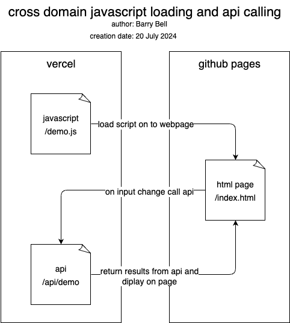

# loading scripts and using api's demo

This is a demo to load a script (vercel) on to a page (github pages) from another domain. That script (vercel) watch's for a change on a form field on the page (github pages). When this happens it post's off the value from the field to the api (vercel), which is on the same domain as the script (vercel). When the return value comes back it is displayed on the page (github pages) that loaded the script.

## vercel

The script and api are on vercel at the url's

https://html-javascript-data-flow-website.vercel.app/demo.js

https://html-javascript-data-flow-website.vercel.app/api/demo

## github pages

The page that loads the script that uses the api is

https://imahome.github.io/html_javascript-data-flow_website/

Script on the html page

https://imahome.github.io/html_javascript-data-flow_website/index-local.html

### diagram

